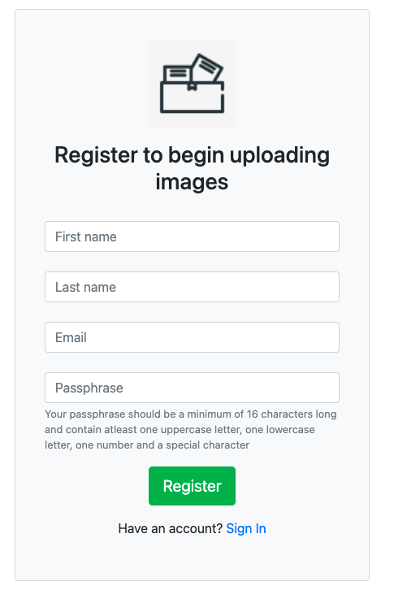

# Shopify-imgRepo

## Scope of work
As part of Shopify's Data Engineering Technical Challange, we were tasked with building an image repository.  
For this project, a web app was developed for users to be able to upload images from their local computer up to an AWS S3 instance for storage. The actual image file is stored in an AWS S3 bucket under a directory named after their user's id and the image file name and file location are stored in a local Postgresql database.

 

## Local Setup
Complete the following tasks to run the application on your local system:

1. Clone repo 
2. Create database 
3. Create AWS S3 bucket
4. Setup the following .env variables 
    - FLASK_APP
    - FLASK_ENV
    - SECRET_KEY
    - DATABASE_URL
    - AWS_BUCKETNAME
    - AWS_ACCESS_KEY_ID
    - AWS_SECRET_ACCESS_KEY
5. activate virtual environment via pipenv shell
6. install all libraries in Pipfile 
7. In the Terminal, run 'Flask run'
8. On your browser, go to localhost:5000 and you'll visit the landing page.

 

## Screenshots of application

### Landing Page

 

### Registration Page

 

### Login Page

 

### Gallery View Before Upload

 

### Gallery View After Upload

 

## Instructions
1. After landing on the main page, register for a new account if you're a new user. You'll need to enter your
first and last name along with an email address and a 16 character passphrase including numbers and special characters.
2. If you're already a registered user, log in using your email and passphrase.
3. Once you're logged in, any images you've already uploaded will generate in your gallery.
4. Click "Choose File" to select the image saved locally on your computer.
5. Click upload to save the file to the cloud and view it in your gallery below.

 

## Possible updates in future

As this was a brief techincal challenge for Shopify, features and functionality were minimal. Given more time,
the following ideas can be implemented:

- expand data model to include more details/metadata about the image
- expand testing suite
- Ability to bulk upload/export images
- Ability to delete images by clicking a button
- Set images to default (images are currently public by default)
- Apply tags to images to improve search capabilities
- Mint images as NFT and sell on OpenSea or another NFT marketplace